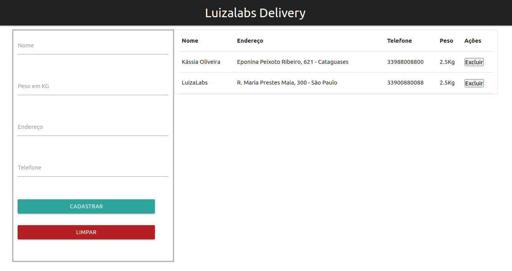
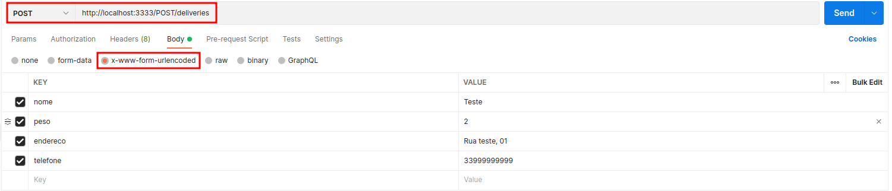
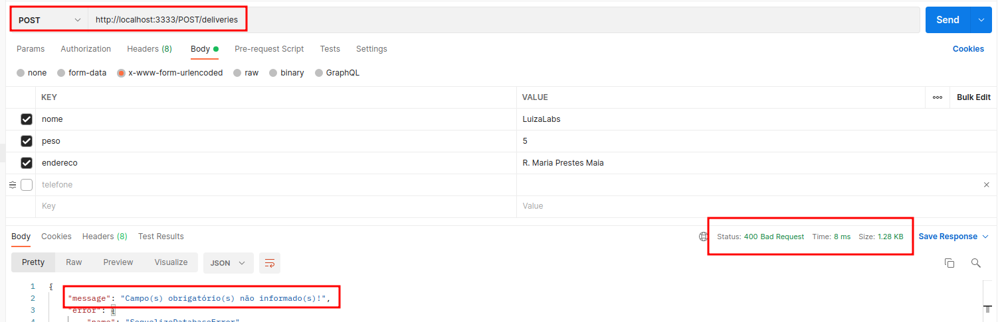

# Criação e Consumo de APIs Restful



## Frontend
| Depedências  | Links |
| ------ | ----- |
| axios | [link](https://github.com/axios/axios#readme) |
| querystring | [link](https://github.com/sindresorhus/query-string#readme) |
| react | [link](https://reactjs.org/) |
| react-dom | [link](https://reactjs.org/docs/react-dom.html) |
| react-scripts | [link](https://github.com/facebook/create-react-app#readme) |

- CSS Style - (html tags em index.html): [Materialize](https://materializecss.com/)

### Executar App React:

- `npm install` <br>
- `npm start`<br>
- Porta: http://localhost:3000

## Backend

| Dependências | Links |
| ------ | ----- |
| cors | [link](https://github.com/expressjs/cors#readme) |
| express | [link](https://expressjs.com/) |
| sequelize | [link](https://sequelize.org/) |
| mysql2 | [link](https://yarnpkg.com/package/mysql2) |
| dotenv | [link](https://www.npmjs.com/package/dotenv) |  

| Dependências Dev | Links |
| ------ | ----- |
| nodemon | [link](https://nodemon.io/) |
| sequelize-cli | [link](https://github.com/sequelize/cli#readme) |

### Iniciar o servidor API: 

- `npm install`<br>
- `npm start`<br>
- Porta: http://localhost:3333

### Api Routes:

| Método | Rota |
| ------ | ------ |
| get | /GET/deliveries |
| post | /POST/deliveries |
| delete | /DELETE/deliveries:id |

### Configurar variáveis de ambiente

Copie o arquivo `env.exemplo` deste projeto e altere o nome para `.env` (que será ignorado pelo Git):

```bash
cp .env.exemplo .env
```
Defina cada variável em `.env`:

- `MYSQL_HOST` - URL do seu host MySQL.
- `MYSQL_DB_NAME` - O nome do banco de dados MySQL desejado.
- `MYSQL_USER` - O nome do usuário MySQL com acesso ao banco de dados.
- `MYSQL_PASSWORD` - A senha do usuário MySQL.

### Executar scripts de migração

Você precisará executar uma migração para criar a tabela necessária para o exemplo.

- Criar o banco de dados:
```bash
npx sequelize db:create
```
- Criar as tabelas no banco de dados:
```bash
npx sequelize db:migrate 
```
- Popular as tabelas:
```bash
npx sequelize db:seed:all
```

### Backend - Postman

#### POST
Para cadastrar um delivery via Postman será necessário informar o nome, peso, endereço e telefone através da rota http://localhost:3333/POST/deliveries.



Retorno:
```json
{"error":false,"data":{"id":7,"nome":"Teste ","peso":"2","endereco":"Rua teste, 01 ","telefone":"33999999999","updatedAt":"2021-11-23T19:34:58.590Z","createdAt":"2021-11-23T19:34:58.590Z"},"message":"Delivery criado com sucesso!"}
```
Status 400:



#### GET
Para listar todos os deliveries via Postman acesse a rota http://localhost:3333/GET/deliveries.

#### DELETE
Para deletar um delivery via Postman acesse a rota http://localhost:3333/DELETE/deliveries/1 e passe o ID que deseja remover.


